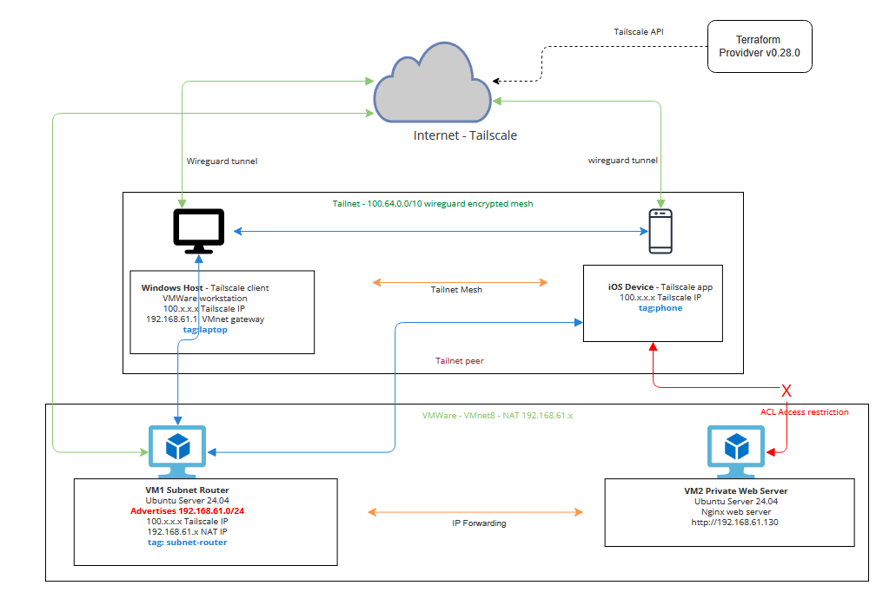

# Tailscale Lab
A small local lab setup to demonstrate Tailscale subnet routing, managed with Terraform (IaC). A private web server that sits behind the VM (Tailscale Subnet Router) is to be reachable only through Tailscale network and not directly accessible from the internet or the host machine. Utilizing tags and ACL to restrict access for a phone within the Tailscale network to have access to private web server 

---

## Overview

This lab has a Tailscale subnet router that exposes a private web server inside a local VMware environment. The subnet router the Tailscale network and advertises a private CIDR, allowing authorized devices to reach the private server securely through an envrypted Wireguard Tunnel and restrict access to some of the authorized device through tagging and ACL.

## Overview of the choices made

### Environment - Local VMware Worstation
Entirely deployed on a local windows machine 11 using VMware workstation with two Ubuntu Server 24.04 VMs where VM1 serves are a Tailscale Subnet Router and VM2 as a private web server. Costs at zero and demonstrates that Tailscale routing works in any environment and not just cloud infrastructure. Looks really adoptable for SMB, mid market hybrid, non cloud or legacy on-prem environments too. 

### IaC Tool - Terraform
Opting Terraform due to prior familiarity and ease of use when working with new solutions. Terraform manages all Tailscale resources programmatically using the official Tailsvale provider (V0.28.0). This included ACL policies, auth keys, tag ownership and auto route approval. Ensures Tailscale configuration is fully reproduceable with code. 

### Backend Service - Nginx
A lightweight nginx web server runs as a private server VM serving a simple custom HTML Page. Chose Nginx for it's simplicity and low resource footprint and it's ideal for a lab enviroment where both the VMs used share a single host machine.

### Networking - VMware Nat
Both Vms are connected to VMware's Nat network (192.168.61.0/24). The subnet router VM1 advertises this CIDR into the Tailnet, making private server VM2 reachable through Tailscale despite having no Tailscale client installed. 

---

## Resoruces used

-Windows 11 host machine
-VMware workstation to host two Ubuntu VMs (subnet router and private server)
-iOS to test the ACL restriction on authorized devices to private server 
-Terraform 
-Git
-Tailscale free tier account
-Ubuntu Servers

---

## Deployment Instructions

### 1. Clone the repository

```bash
git clone <https://github.com/vxrshxnovx/tailscale-lab.git>
cd tailscale-lab
```

### 2. Configure Tailscale credentials

Create a `terraform.tfvars` file: that contains:
tailscale_api_key and tailnet_name 
This file is gitignored

Generate your API key at: https://login.tailscale.com/admin/settings/keys

### 3. Initialize and apply Terraform

This creates the ACL policy (Tag based access control), auth keys (for `tag:subnet-router`,`tag:phone` ) and route auto-approval in the tailnet.
Athough a valid tag laptop is created for the windows machine through code, I have here tried to authenticate my windows host manually through Tailscale admin console. In a fully automated deployment, the third auth key with `tag:laptop` would be generated via terraform and be used to enroll the windows device. 

### 4. Creating VM1 Subnet Router and Installing Tailscale

Create VM1 - subnet router

I created a ubuntu server use what works best for you on platform of your relevance
After installation, I had to configure networking ie, making sure subnet router has internet connectivity, enable IP forwarding etc. (Quick Note: Might not apply for everyone's use case). 

Once the VM is set up.

Install Tailscale and join the Tailnet:

```bash
curl -fsSL https://tailscale.com/install.sh | sh
```
Once the subnet router is authenticated to Tailscale with the auth key, route advertisement is handled on the subnet router and Route approval for the tagged device/subnet router is automated via autoApprovers on the ACL policy as per the code. 
(Quick Note: Subnet_router_auth_key can be retrieved using the terraform output or will also be available on Tailscale admin console in case for verification)

### 5. Create VM2 Private Web Server

Creating VM2 or a second VM Server which servers as private web server and configured networking. 

Install Nginx:

Deploy a Custom web page as per your wish, I created a sample HTML Page

Voila! You have your devices set up and ready to validate

### 6. iOS device to verify ACL restriction 

Downloaded tailscale from appstore and retrieved the phone_auth_key from terraform out and authenticated the iOS device, verified valid tags and ACLs exist
The ACL here for `tag:phone` allows access only to the subnet router and windows machine but not to the advertised route.

## Validation
The connectivity was validated by pinging and accessing the private web server from the windows host through the Tailscale Subnet router. 

step1: verify VM1 subnet router can access VM2 private web server directly (I had both VM's on the same Nat network)

step2: verify windows host cannot reach private web server directly without Tailscale routing

step3: with Tailscale running and subnet route approved, the custom nginx page can be accessed my navigating to it's address on the windows browser.

This confirms that the traffic is routing from the Windows host through the Wireguard Tunnel to VM1 subnet router, then forwarded via IP forwarding to VM2 private web server on the private NAT network

step4: Now to verify ACL deployed for zero trust based on device tags, tried accessing private server from phone and the web page is not accessible with the ACL removed, as expected phone being one of the authorized device it can access the adveristed route as well. 

## Reflection 

### what went well
1. Terraform successfully manages the full Tailscale policy year very seamlessly using very minimal code, VM provisioning is done manually. Although in production this can be handled by cloud-init scripts on cloud VMs.
2. The subnet routing pattern worked effectively. 
3. Found tagging devices capability really convenient, it demonstrates clear and realistic zero trust access model.

### Alternatives considered
1. AWS deployment would have enabled cleaner IaC with EC2 user-data scripts for full automation 

### AI disclosure
Utilized to get help structure terraform configuration syntax and terrform capabilities as I am still learning terraform. 

## Tailnet Name
vxrshxnovx.github

## Architecture Diagram




